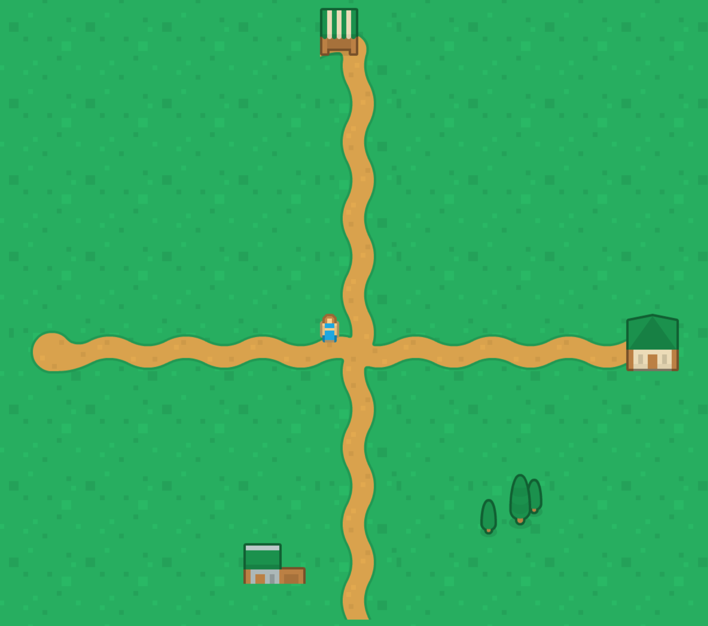

# Turkish Pixels

A simple game to help you learn and use Turkish words



## About
Built with:
  * [PixiJS](https://github.com/pixijs/pixi.js)
  * [pixi-tilemap](https://github.com/pixijs/pixi-tilemap)
  * [RxJS](https://github.com/ReactiveX/rxjs)
  * Many 2D assets by [Kenney](https://kenney.nl/) 

## Development
Requirements:
  * git
  * node.js v14.9.0+

After cloning this repo:
```
npm i
npm start
```

Game should be accessible at http://localhost:8886

## Deployment from source
Requirements:
  * git
  * Docker

After cloning this repo:
```
docker build -t tkpx .
docker run -p 5000:5000 tkpx
```
Game should be served on port 5000

## Deployment from github packages
Every commit to master uploads the docker image to the github docker registry.

Requirements:
  * Docker
  * [A github personal access token](https://docs.github.com/en/free-pro-team@latest/github/authenticating-to-github/creating-a-personal-access-token)

```
cat ~/GITHUB_TOKEN.txt | docker login https://docker.pkg.github.com -u <YOUR_USERNAME> --password-stdin

docker pull docker.pkg.github.com/markcarrier/turkish-pixels-2/tkpx:latest
docker run -p 5000:5000 -d docker.pkg.github.com/markcarrier/turkish-pixels-2/tkpx
```


